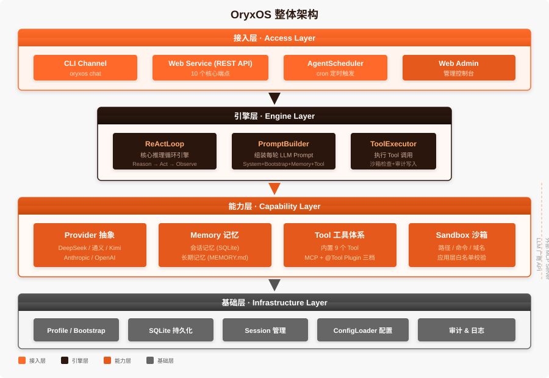

<p align="center">
  
</p>

<h1 align="center">OryxOS</h1>

<p align="center">
  <strong>企业级 Agent OS · Java 原生 · 私有可控 · 全链路可审计</strong>
</p>

<p align="center">
  <a href="https://github.com/oryx-labs/oryxos/blob/main/LICENSE"></a>
  <a href="https://www.java.com"></a>
  <a href="https://spring.io/projects/spring-boot"></a>
  <a href="https://maven.apache.org"></a>
</p>

---

## 什么是 OryxOS？

**OryxOS** 是基于 Java 21 实现的面向企业场景的 **Agent OS**。它装在企业自己的 K8s 或服务器上，作为统一底座运行各种业务 Agent（运维助手、客服助手、HR 助手、知识管理助手等），共享一套渠道接入、模型路由、工具调用、记忆系统、沙箱执行能力。数据完全留在企业自己的基础设施，不锁任何云生态。

> **你用一句自然语言发布一个任务 → 底座把它拆解 → 组织一支 Agent 团队 → 多个 Agent 分工协作 → 交付一个结果。**

### 为什么需要 OryxOS？

每家公司都有该交给 Agent 的活，但 Agent 大多还停在 demo，卡在四道门槛上：

1. **定义一个 Agent 要写代码** — 最懂业务的人反而做不了
2. **云平台要把数据拿走** — 合规过不去
3. **执行是黑盒** — 没审计、没白名单、没审批，企业不敢上生产
4. **跑一个容易、跑一群难** — 没有人把「一群 Agent 的操作系统」这一层交给你

OryxOS 一次拆掉这四道门槛：**自然语言定义、私有部署、全链路审计加沙箱、以及为一整队 Agent 准备的生命周期与治理。**



## 五大核心能力

| 能力 | 说明 |
|------|------|
| 🤖 **对接 LLM** | Provider 抽象统一对接主流大模型（DeepSeek、通义、Kimi、智谱、Anthropic、OpenAI），Agent 不感知具体厂商，运行时切换无锁定 |
| 🧠 **ReAct 循环** | 自实现推理引擎：Reason → Act → Observe，LLM 思考是否调工具、调哪个，OryxOS 执行后回填结果，循环行为完全可控 |
| 💾 **记忆系统** | 会话记忆 + 长期记忆两层，跨对话保留用户偏好、项目背景、关键决策，让 Agent 越用越懂你 |
| 🔧 **工具体系** | 内置文件/Shell/HTTP/通知 9 个 Tool + Plugin Tool 三档接入（零代码/MCP/@Tool 注解），按门槛自由选择 |
| 🌐 **Web Service** | 完整 REST API 对外暴露所有能力，任何开发语言都能集成，覆盖会话管理、Agent 调用、系统状态 |

## 核心特性

- 🤖 **一个目录 = 一个 Agent** — 一个包含 `AGENT.md` 的目录定义一个 Agent，不用写代码，多个 Agent 同实例并存
- ☕ **Java 原生** — 基于 Java 与 JDK 21，单可执行 JAR 单二进制部署，复用现有 Java 运维工具链
- 🔒 **私有可控** — 装在企业自己的 K8s、虚拟机或物理机上，数据不出域，不锁任何云
- 🛡️ **安全隔离** — 工具调用经文件/命令/网络白名单校验，强制沙箱隔离，凭证走环境变量不落地，全链路可审计
- 🧠 **自实现 ReAct** — 核心推理循环自己实现，不套外部 Agent 框架，机制完全可控
- 🔌 **对接开放标准** — 工具用 MCP、Agent 协作用 A2A、Agent 目录借 Anthropic Agent Skills 形态，与生态协同
- 🧩 **三档工具扩展** — 从零代码 Agent 目录到自写 MCP server 到原生方法，按门槛自由选择
- 💾 **跨对话记忆** — 会话加长期两层记忆，让 Agent 记得住上下文
- 🌐 **无状态可扩展** — 运行实例无状态、状态外置，从架构起为走向分布式留好路

## 快速开始

### 环境要求

- JDK 21+
- Maven 3.9+

### 构建

```bash
git clone https://github.com/oryx-labs/oryxos.git
cd oryxos
mvn clean package -DskipTests
```

### 5 分钟快速体验

```bash
# 1. 初始化工作区
java -jar oryxos-boot/target/oryxos-boot-1.0.0-SNAPSHOT.jar init

# 2. 创建一个 Agent
java -jar oryxos-boot/target/oryxos-boot-1.0.0-SNAPSHOT.jar profile create weather

# 3. 配置模型凭证（环境变量，绝不明文写文件）
export DEEPSEEK_API_KEY=sk-xxx

# 4. 开始对话
java -jar oryxos-boot/target/oryxos-boot-1.0.0-SNAPSHOT.jar chat --profile weather
```

### 启动 API 服务

```bash
java -jar oryxos-boot/target/oryxos-boot-1.0.0-SNAPSHOT.jar serve --port 8080
```

访问 `http://localhost:8080/api/v1/health` 确认服务正常。

## 项目结构

```
oryxos/
├── oryxos-core/           # 核心抽象：ReActLoop、Profile、AgentLoader、ContextLoader
├── oryxos-provider/       # LLM Provider 抽象与显式映射
├── oryxos-memory/         # 记忆系统：MemoryService 门面、LongTermMemory
├── oryxos-tool/           # 工具体系：内置 Tool、MCP Client、Sandbox、ToolRegistry
├── oryxos-channel-cli/    # CLI Channel 实现
├── oryxos-web/            # REST API：10 个核心端点
├── oryxos-storage/        # SQLite 持久化层
├── oryxos-cli/            # Picocli 命令行入口（12 个子命令）
├── oryxos-boot/           # Spring Boot 启动模块
├── docs/                  # 设计文档
├── website/               # VitePress 官网
└── scripts/               # 构建与部署脚本
```

## API 端点

| 端点 | 说明 |
|------|------|
| `POST /api/v1/sessions` | 创建会话 |
| `POST /api/v1/sessions/{id}/messages` | 发消息 |
| `GET /api/v1/sessions/{id}` | 查历史 |
| `DELETE /api/v1/sessions/{id}` | 归档会话 |
| `POST /api/v1/agents/{name}/invoke` | 无状态调用 |
| `GET /api/v1/profiles` | 列 Profile |
| `GET /api/v1/memory` | 查长期记忆 |
| `GET /api/v1/tools` | 列可用 Tool |
| `GET /api/v1/health` | 健康检查 |
| `GET /api/v1/info` | 运行信息 |

## 架构

OryxOS 整体分四层：

1. **接入层** — CLI Channel、REST API、定时任务调度器
2. **引擎层** — ReActLoop、PromptBuilder、ToolExecutor
3. **能力层** — Provider、Memory、Tool
4. **基础层** — Profile/Bootstrap 加载、Session 存储、SQLite、配置管理

## 设计原则

- **底座优先于 Agent** — 最重要的交付不是某个强大的 Agent，而是让任意 Agent 都能可靠运行的环境
- **自实现核心，可控优先** — 核心推理循环自己实现，底层模型协议适配复用成熟库
- **配置即 Agent** — 一个 Agent 由一份 `AGENT.md` 定义，而不是由代码写出
- **对接开放标准** — 工具用 MCP、协作用 A2A、技能用开放格式
- **安全是地基不是补丁** — 工具来源受控、最小权限、强制沙箱、凭证不落地、全链路可审计

## 路线图

| 阶段 | 重点 |
|------|------|
| **阶段一（当前）** | 单机运行时内核：五大核心能力 + 多 Agent 并存 + REST API + MCP |
| **阶段二（规划）** | 底座分布式：节点无状态化、多副本部署、高可用 |
| **阶段三（愿景）** | 跨节点 Agent 协作：A2A 通信底座、跨节点发现、委托、协同 |

## 技术栈

- **JDK 21** + Spring Boot 3.x（Virtual Thread）
- **Spring AI Alibaba**（LLM Provider 抽象与协议转换）
- **自实现 ReAct Loop**（Agent 核心引擎）
- **Spring MVC**（REST API）
- **Picocli**（CLI 工具）
- **SQLite + Spring Data JPA**（持久化）
- **MCP Java SDK**（外部工具集成）
- **VitePress**（官网文档）

## 许可证

[Apache License 2.0](LICENSE)

## 社区

OryxOS 是 [oryx-labs](https://github.com/oryx-labs) 旗下的开源项目。欢迎通过 Issue、PR 和 Discussions 参与贡献。

---

<p align="center">
  <strong>让每一家公司，都能用自然语言跑起来自己的 Agent。</strong>
</p>
